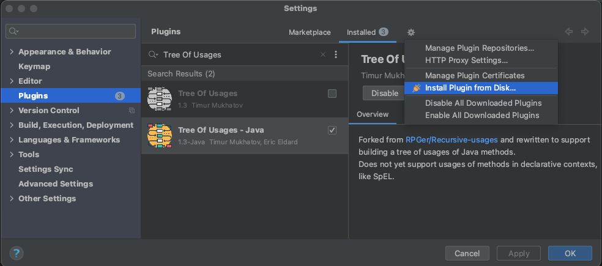
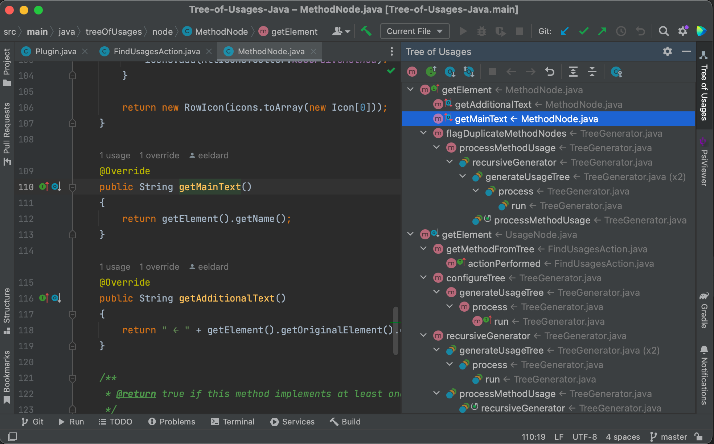

# Tree of Usages (Recursive usages) - Java

Forked from [RPGer/Recursive-usages](https://github.com/RPGer/Recursive-usages)

This IntelliJ plugin helps to recursively find all usages of a Java method and creates a tree of those usages.
Use it to walk your call trees and understand the impact of your changes.

### To Build
From this directory, run
 `./gradlew build` (*nix)
 `gradlew.bat build` (Windows)

### To Install

1. Navigate to Settings > Plugins
2. Choose "Install Plugin from Disk..."
3. Select `Recursive-usages-Java/build/distributions/Recursive-usages-Java-2.1.1.zip`
4. Restart IntelliJ and wait for indexing to complete

### To Use

1. Select a method in the editor
2. Click the Build Tree button
3. ...
4. PROFIT!

* Back and Forward buttons allow you to scroll through the history of trees you've built
* Once the first tree is built, methods can be selected from either the editor or the tree results
    * Building from a method in the editor always resets the history

### Support
* Standard instance method usages
* Usages as method references
* Static method usages
* Method usages in static initialization blocks
* Method usages in field initializations
* Usages of immediate parents of method
* Usages of immediate children of method

Does not yet support usages of methods in declarative contexts, like SpEL and XML. No Lombok support.

### Feel free to provide feedback or report a bug